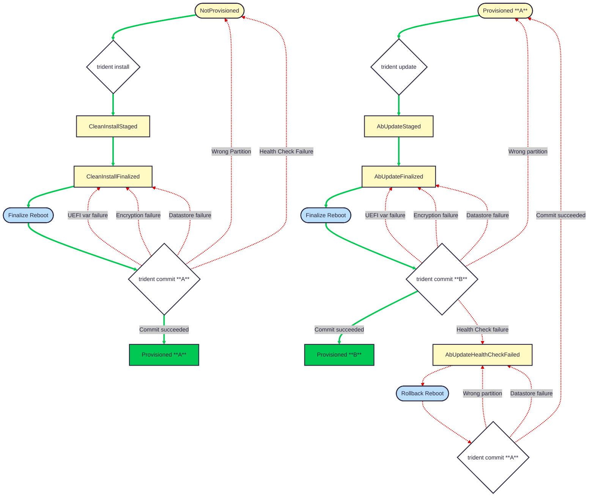

# Health Checks

`Health checks` have been implemented to enable customers to define whether a servicing operation leaves the target OS in a healthy state. These `health checks` are run during `trident commit` and can run customer-defined [scripts](../Reference/Host-Configuration/API-Reference/Script.md) and/or verify that [systemd services are running](../Reference/Host-Configuration/API-Reference/SystemdCheck.md).

If any health check fails:

* **for A/B update**: a rollback will be initiated by `trident commit`, updating the Host Status state to `AbUpdateHealthCheckFailed` and triggering a reboot into the previous OS. Within the previous OS, `trident commit` will validate the boot partition and update the Host Status stae to `Provisioned` (reflecting that the machine is now Provisioned to the previous OS).
* **for clean install**: a rollback will **NOT** be initiated as there is no previous OS. Instead, the Host Status state will be set to `NotProvisioned`.

## Configuring Health Checks

Health checks can be configured in the Host Configuration file under the [`health.checks`](../Reference/Host-Configuration/API-Reference/Health.md#checks-optional) section. Any number of [scripts](../Reference/Host-Configuration/API-Reference/Script.md) and/or [systemd checks](../Reference/Host-Configuration/API-Reference/SystemdCheck.md) can be defined.

Scripts here are like the other scripts in Trident (e.g. [preServicing](../Reference/Host-Configuration/API-Reference/Scripts.md#preservicing-optional)), for example, an inline script can be defined in `health.checks` to query the network or some Kubernetes state like this:

```yaml
health:
  checks:
  - name: sample-commit-script
    runOn:
    - ab-update
    - clean-install
    content: |
      if ! ping -c 1 8.8.8.8; then
        echo "Network is down"
        exit 1
      fi
      if ! kubectl get nodes; then
        echo "Kubernetes nodes not reachable"
        exit 1
      fi
```

[Systemd checks](../Reference/Host-Configuration/API-Reference/SystemdCheck.md) can also be defined to ensure that critical systemd services are running after servicing.  For example, to ensure that `kubelet.service` and `docker.service` are running within 15 seconds of `trident commit` being called for both clean install and A/B update servicing types:

```yaml
health:
  checks:
  - name: sample-systemd-check
    runOn:
    - ab-update
    - clean-install
    systemdServices:
    - kubelet.service
    - docker.service
    timeoutSeconds: 15
```

## Behavior

Health checks are run during `trident commit`. `trident commit` must be run to complete any servicing action. You can see how `health checks` fit into the overall servicing flow in these diagrams:


